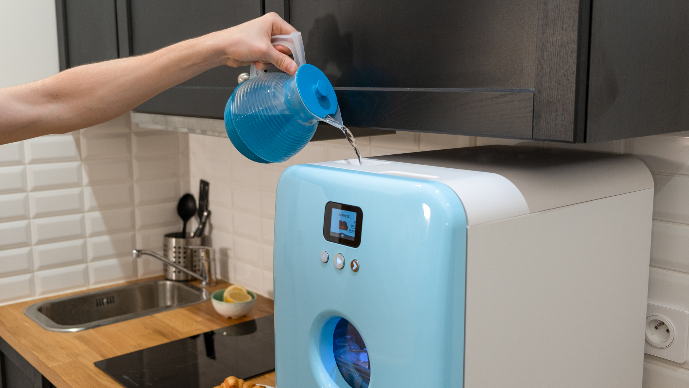
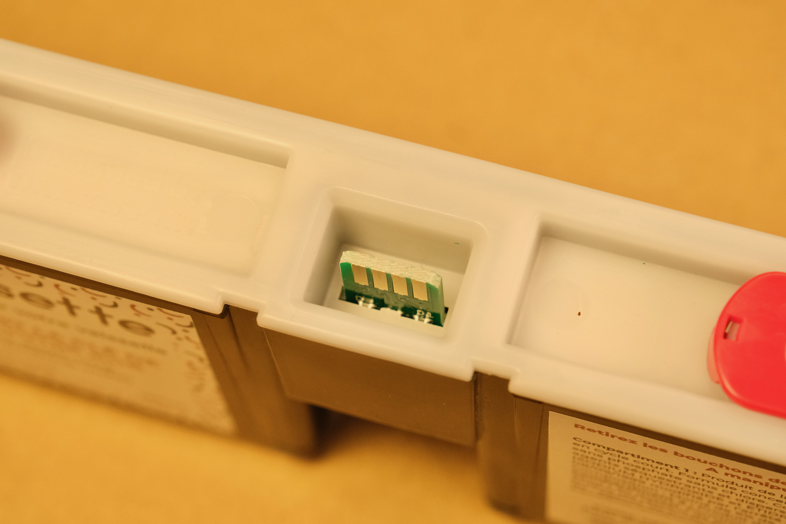
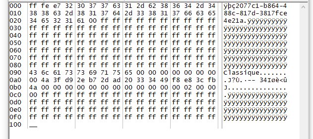
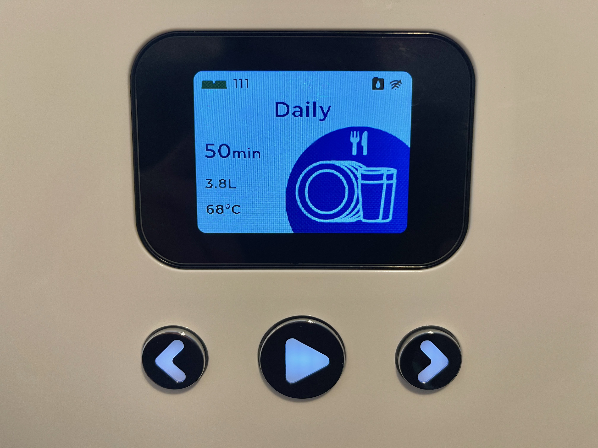
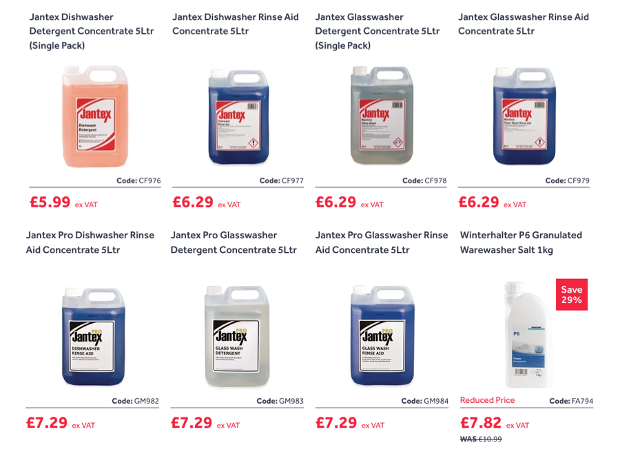
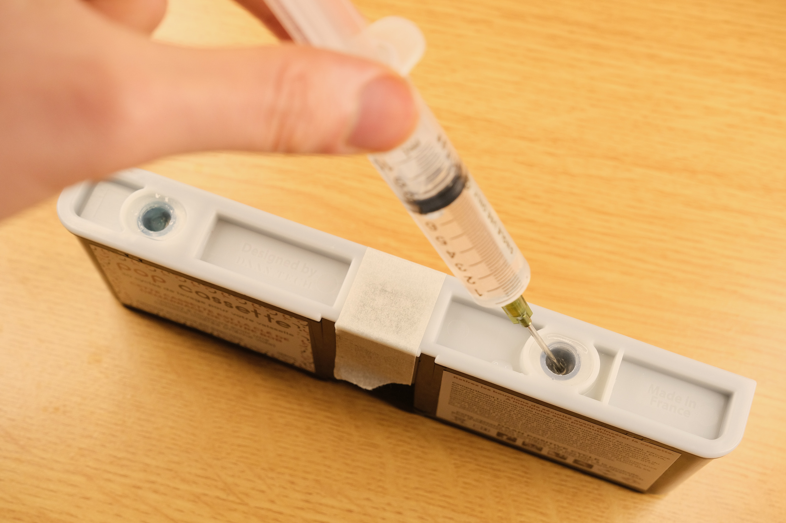
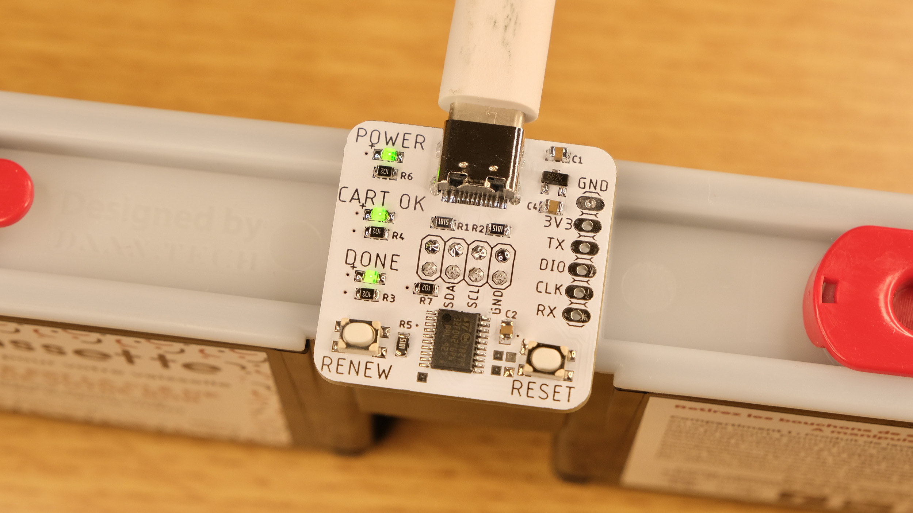
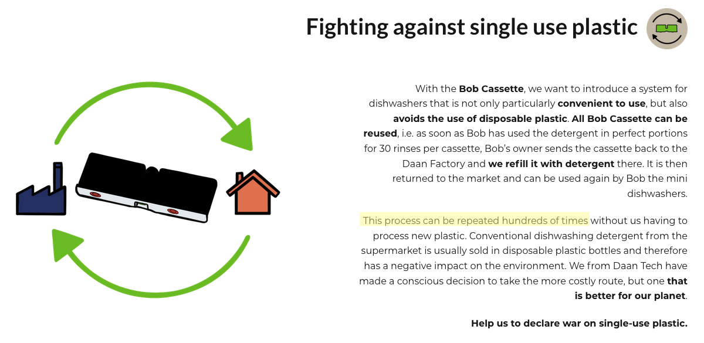

# Bob Cassette Rewinder: Hacking Detergent DRM for 98% Cost Saving

[Get Bob Rewinder](https://www.tindie.com/products/23316/) | [Official Discord](https://discord.gg/gyGFqD2vfP) | [User Manual](user_manual.md)

---

How I defeated [Bob Dishwasher](https://daan.tech/en/product/bob-mini-dishwasher/)'s detergent cartridge DRM to refill it at 1/60 of the cost of buying new.

## Get one / Discord

To get your own Bob Rewinder, [visit here](https://www.tindie.com/products/23316/).

Feel free to [join our discord](https://discord.gg/gyGFqD2vfP) for questions, discussions, and announcements.

## Introduction

Back in Jan 2021, I watched Techmoan review the [Bob Dishwasher](https://www.youtube.com/watch?v=hVup5ya0WVQ) by Daan Tech. In short, Bob is a sleek and compact countertop dishwasher with a built-in water tank that can be filled by hand, requiring no plumbing and minimal space.

He seemed to be quite impressed, mentioning its ease of setup and use. I liked the idea myself too, and ordered one soon afterwards.

It arrived after a 2-months wait, and overall I'm very happy with it. It fits on my kitchen top, has enough space for my dishes, uses a tiny amount of water, and overall works just fine. No problems.

It is also internet-connected (of course), but I never let it online. Why in the world does a dishwasher needs internet anyway?

## Bob Cassettes

One of the headline features of Bob dishwasher is the [Bob Cassette](https://daan.tech/en/discover-bob-cassette/), an all-in-one detergentxor
 cartridge. Just pop it in and off you go! No need to manually measure and add detergent each wash, very convenient!

There are two types of Bob Cassettes:

### Pop Cassette

* Contains washing detergent and rinse aid

* Lasts 30 washes

### Rock’n’roll Cassette

* Contains cleaning agent and limescale remover

* Deep cleans and maintains Bob

* Should be used every 90 cycles

* Lasts 1 wash

### Advantages

Daan Tech quoted several benefits of Bob Cassettes:

* Simple to use, no need to add detergent every wash, less mess.

* Exact needed quantity is dispensed, less waste.

* 2-stage dispensing. Detergent first, rinse aid at later stage.

* Made from recycled plastic, and can be mailed back and reused.

## Outrageous Cost

While those points are perfectly valid and I did enjoy using the cassettes, such convenience comes with a cost, and Daan Tech is more than happy to take it off your hands. Looking at [their website](https://daan.tech/en/product/compilation-pop-rock/), a 4-pack costs £29.90:

With shipping and VAT added, it costs a whopping **£43 ($60) for 90 washes**! That is 48p (67c) per wash. It might not sound like much, but it quickly adds up.

Over a year of daily washes, it would have cost **£174 ($242)** in Bob cassettes alone! Imagine paying that much recurring cost for a dishwasher!

And remember its internet connectivity? Yep, the whole reason is that it can reorder more cassettes automatically when it runs low, just like those wretched HP inkjet printers.

It is clear that Daan Tech are banking on the convenience of subscription models. Now I'm sure a lot of people would have no problem with that, but personally, I can think of a few better uses of my £174 than on dishwasher detergents.

Another point to consider is what happens if they went bust? No more cassettes, and now you have a fancy paperweight, like so many unnecessarily-smart appliances before it.

## Alternatives

Credit where credit's due, Daan Tech didn't completely lock down the machine with Bob cassettes. Once empty, you *can* leave it there and add detergents manually. However, they strongly suggest against this, quoting a few drawbacks:

* It's a chore to measure and add them manually at each wash.

* Dosing can be tricky, as most tablets, pods, and liquids are for full-size dishwashers.

* Multi-stage dosing impossible, can't add rinse aid after main wash.

* Limescale might develop over time and damage the machine.

It is clear that this dishwasher was designed with Bob cassettes in mind, and I do enjoy their set-and-forget simplicity. That's why I made it a priority to investigate how it works.

## A Closer Look

Looking at the cassette, we can see it has a small circuit board in the middle, with 4 contacts on each side:

At the receptacle, we can see the connector for the PCB, as well as two hoses to pump out the detergent during a wash:

Notice there are only 4 wires going into the machine. Coupled with the fact that Bob needs to read the cassette to determine how many washes are left, and write to update it after a wash, I had a pretty good guess of what that mystery PCB contains.

The answer is an **I2C EEPROM**, a popular type of non-volatile memory. EEPROMs retain whatever's inside even after losing power, and are very cheap, making them perfect at holding small configuration data in embedded systems.

To settle it once and for all, I extracted the PCB from the casing by melting the plastic with a soldering iron. A bit messy, and I probably should have used a dremel, but I didn't have one.

A closer look at the PCB confirmed my suspicion:

It's simply a 24C02 EEPROM with 4.7K pull-ups on I2C lines, a bypass cap, and some diodes, probably for reverse-insertion protection.

Looking at the [datasheet](resources/FT24Cxxx.pdf), 24C02 can only hold 256 *bytes* of data, so I guess there probably isn't much going on, but we'll need to dump its contents to be sure.

## Bob the Dumper

So my plan now is to read what's inside the EEPROM. It seemed that a special connector is needed, but after rummaging around the parts bin, I found that it fits into a USB-A female socket just fine! Although I had to insulate the metal case so it won't short on the PCB contacts.

I found a leftover board from [pimping my microwave](https://github.com/dekuNukem/pimp_my_microwave), and quickly threw together a contraption to read the EEPROM:

It would just read all 256 bytes and print them over serial, and I wrote a short [Python script](/bin_dump/bob_dump.py) to save them as a `.bin` file.

Here is a quick look at whats inside a Pop cassette, with 26 washes left:

We can see that:

* Most of the EEPROM is unused (`0xff`)

* There is a UUID-like ASCII string at the beginning

* `Classique` seem indicate the cassette type

There are few other bytes here and there, I didn't know what they do, but it doesn't really matter for now. I wanted to see what changes after another wash.

So I put the cassette back, had another wash, dumped it again, and compared the difference:

Voilà, there it is! Only one byte is different at address `0xa1`, and it went down from 0x4A to 0x49 while going from 26 to 25 washes.

Doing some interpolation, it seems that byte starts from 0x4e at 30 washes, and goes down from there.

I changed it to 0x3f, which should be 15 washes, and put it back. This happened:

111 washes! Looks like they didn't do much bound checking 😅.

A bit perplexed, I tried several other values. In the end, it seems that the mapping is like this:

| Washes Left | Value @ 0xa1 |
|:-----------:|:------------:|
|      30     |     0x4e     |
|     ...     |              |
|      16     |     0x40     |
|      15     |     0x5f     |
|     ...     |              |
|      0      |     0x50     |

[An eagle-eyed user flopp](https://github.com/dekuNukem/bob_cassette_rewinder/issues/8) pointed out the value at 0xa1 is calculated `Washes left` XOR `0x50`, thanks! Not sure why they did it like this, but anyway!

To reset the cassette to 30 washes, all I have to do is **set that byte back to 0x4e**, easy enough!

With the simple EEPROM chip, standard 0.1 inch contact spacing, one-byte counter, and no error checking, it sure seems Daan Tech didn't try really hard, guess they reckoned that it wasn't worth the trouble. Well, less work for me too!

## Now what?

It's great now that I can reset the Bob Cassette counter, but what should I refill it *with*? After all, this whole endeavor would be pointless if they really do have some secret sauce in there that can't be found anywhere else.

Of course, Daan Tech themselves sure wish you don't play around with the cassettes:

So what exactly *is* in those cassettes? Fortunately, they did provide some details in the user manual:

----

----

It's easy to see they kept things a bit vague to discourage loonies like me, but we can still extract some useful information out of it:

* Pop Cassette has two tanks

* Tank 1 contains 130mL of washing detergent, mainly Sodium Hydroxide (NaOH) and Etidronic Acid, less than 5% concentration.

* Tank 2 contains 35mL of rinsing liquid, also less than 5% concentration.

As the names suggest, detergent helps to break down grease and clean the dishes, while rinse aid reduces water streaking and improve drying performance. [Technology Connections did a video](https://www.youtube.com/watch?v=_rBO8neWw04) about this topic, so give it a watch!

I also wanted to find out how much detergent Bob actually uses at each stage of wash, so I did a express wash on Bob, and weighed the waste water at each stage. Its water usage is as follows:

* 1000mL washing

* 650mL to wash off the detergents

* 1200mL Rinsing

Overall, less than 3L of water for an entire load! Very efficient!

----

I can now calculate the **detergent** concentration:

* 130mL tank / 30 washes = 4.33mL per wash

* 4.33mL detergent per 1000mL water = **0.433% concentration, or 1:231 dilution**.

Similarly for **rinse aid**:

* 35mL tank / 30 washes = 1.17mL per wash

* 1.17mL rinse aid per 1000mL water = **0.117% concentration, or 1:855 dilution**.

## A Clean Getaway

With those information, I can begin searching for similar dishwasher liquids on the Internet.

I first tried "Concentrated Dishwasher Detergent", which returned a lot of supermarket dishwasher gel, not quite what I want. But it quickly led to something much more promising.

The magic word appears to be: **`Commercial Dishwasher Detergent & Rinse Aid`** from **Catering supplies** websites.

A quick search showed quite a few very reasonably priced 5L detergents & rinse aids:

Of course, the question now becomes *which one do I pick?* Fortunately, all chemical products in UK comes with a `Safety Data Sheet` by regulation, which contains the composition and concentration of what's inside. This way, I can compare an unknown detergent with Bob Cassette and get a rough idea of how close it is.

Looking at the cheapest detergent (top-left), [its instruction](https://www.nisbets.co.uk/jantex-dishwasher-detergent-5-litre/cf976) states:

The dilution ratio from my earlier calculation was 1:231, right in the ballpark. Looking the data sheet:

Similar composition and concentration too! Both less than 5%.

Moving on to the cheapest [rinse aid](https://www.nisbets.co.uk/jantex-dishwasher-rinse-aid-5-litre/cf977):

Again, spot on. So there you go! Perfectly good substitutes for the detergents inside Bob cassettes.

Of course, I do realize that the chemical composition might not be 100% same, at least according to the label. But those bulk detergents are for use in professional commercial kitchens, so they are unlikely to be weak stuff. And just wait until we get to the cost analysis!

## Cost Showdown

Now comes the good part, let's work out how much I save by using commercial detergents.

### Detergent

* £5.99 ex-VAT, £7.2 with VAT

* 5000mL / 4.33 mL per wash = 1154 washes

* £7.20 / 1154 = £0.0062 = 0.62p per wash

### Rinse aid

* £6.29 ex-VAT, £7.60 with VAT

* 5000mL / 1.17 mL per wash = 4273 washes

* £7.60 / 4273 = £0.0018 = 0.18p per wash

----

With that, the **total cost per wash** is:

0.62p + 0.18p = **0.80p**, or **1.1 US cents**!

We know from earlier that Bob Cassettes costs **48p (67c) per wash**.

Therefore, refilling it yourself is more than **60 times cheaper**, resulting in a massive **98%** cost saving compared to buying new!

What's more, the 5L detergent can last well over **3 years** of daily wash, while the rinse aid can last almost **12 years**! Over those time you would have spent £2088 on Bob cassettes, and who knows if they will even be around then.

----

Of course, this calculation really is the best-case scenario, it didn't account for shipping of the detergents, and they might go bad before all gets used up. But even considering those possibilities, 2p per wash should be easily achievable, which is still almost 30 times cheaper. It's a no brainer to refill your Bob Cassette if you can.

## Testing it Out

I went out and bought 2 jugs of detergent and rinse aid:

I picked them up locally, so I didn't have to pay shipping. The total came to around £17.

Refilling the cassette is easy, I taped over the PCB window to prevent liquid getting in, and injected the detergents into the cassette with a syringe with blunt needle, poking through the one-way membrane. **`WARNING`**: See [this guide](user_manual.md) for more details if you plan to do it yourself.

I then popped the cassette back, as expected, Bob reads it having full 30 washes left:

I did a wash, and the resulting dishes are just as clean as before, nothing seemed different, except I'm now paying *60 times less* for the privilege! Job done!

## Bob Rewinder Board

Everything's coming together nicely! But as I will refill the cartridge frequently in the future, I do want to make a proper gadget to renew a cassette at the push of a button, instead of using the flying wire contraption earlier.

So I quickly designed a circuit board, christened **Bob Rewinder**, and hand-soldered a prototype:

Bob Rewinder simply plugs into the cassette:

Pressing the `RENEW` button will reset the EEPROM, and I can then refill and re-use the cassette for next to nothing!

## Thoughts and Conclusions

In this project, I wanted to explore the possibility of refilling and reusing Bob cassettes so I can preserve its set-and-forget convenience at a fraction of the cost.

In the process, I...

* Identified the chip inside the Bob cassette.

* Dumped the data and figured out how to reset the counter.

* Calculated Bob's detergent usage and concentration.

* Researched alternative detergent options.

* Performed cost analysis.

* Did a test run with commercial detergents.

* Designed a circuit board to easily renew the cassette.

Looking back, nothing was particularly difficult, but it did involve a lot of topics, and I learned a lot about dishwasher cycles and detergents in the process, probably more than I would have liked :)

-------

What I find ironic is, Daan Tech isn't shy about their ["positive cycle"](https://daan.tech/en/daan-positive-cycle/) of environmentally friendly practices, while having no problem selling you single-use cassettes at 60x of the price that lasts only 30 washes. The only justification is that you are *supposed* to mail them all the way back to France so they can be refilled (and of course, sold again).

If they truly wanted to cut down on single-use plastics, what's wrong with user-refillable detergent compartments like every other full-size and commercial dishwashers? That sure seem a lot less hassle than mailing plastic cartridges back-and-forth around the world.

Despite the DRM and warnings about not to refill the cassettes yourself, they even admitted themselves that the cassettes can be reused **hundreds of times**:

They also mentioned how conventional detergent plastic bottles is bad for the environment, while the cassettes themselves only last 30 washes and uses way more plastic and electronics.

The more I think of it, the more I can draw parallel between Bob cassettes and those overpriced DRM-enabled inkjet cartridges, often costing more than the printer itself. It wouldn't be surprising if Daan Tech took some inspirations from there.

---

In the end, I'm glad I tamed another totally unnecessary subscription-based internet-connected "smart" device, and managed to reuse and refill the cartridge for 1/60 the cost of buying new.

By doing so, the biggest change is I no longer have to worry about using Bob at all. There used to be a constant niggle in the back of my head about getting the most out of each wash, because once it runs out, I'm in for a long wait and expensive bill. Now that the cost is so low, I find myself using it much more liberally whenever I want, often multiple times a day.

Despite my lengthy rants, I actually really like the dishwasher itself. It is quiet, water-efficient, fast, compact, looks great, requires no plumbing, and perfect for small homes. Funny how once DRM-based nickel-and-diming is out of the equation, Bob is actually excellent at its job.

## I want one too!

I have made a few extra Bob Rewinder boards, you can [get it here](https://www.tindie.com/products/23316/).

For instructions on how to use it, [click me!](user_manual.md)

## Other Stuff

I've done a few other fun projects over the years, feel free to check them out:

[duckyPad: Do-It-All Mechanical Macropad](https://github.com/dekuNukem/duckypad): A 15-key mechanical macropad with hot-swap, RGB, and sophisticated multi-line scripting.

[Pimp My Microwave](https://github.com/dekuNukem/pimp_my_microwave): Fixing my microwave by grafting an RGB mechanical keyboard to it!

[Daytripper: Hide-my-windows Laser Tripwire](https://github.com/dekuNukem/daytripper): Saves the day while you slack off!

[exixe: Miniture Nixie Tube driver module](https://github.com/dekuNukem/exixe): Eliminate the need for vintage chips and multiplexing circuits.

[From Aduino to STM32](https://github.com/dekuNukem/STM32_tutorials): A detailed tutorial to get you started with STM32 development.

[List of all my repos](https://github.com/dekuNukem?tab=repositories)

## Questions or Comments?

Please feel free to [open an issue](https://github.com/dekuNukem/bob_cassette_rewinder/issues), ask in my [discord server](https://discord.gg/gyGFqD2vfP), DM me on discord `dekuNukem#6998`, or email `dekuNukem`@`gmail`.`com` for inquires.
